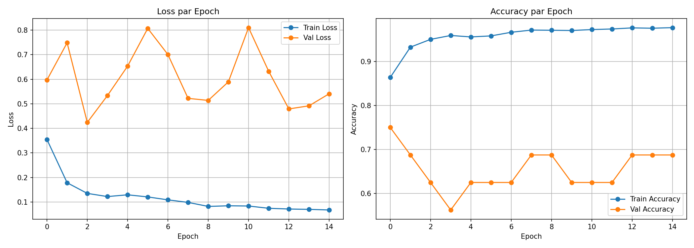
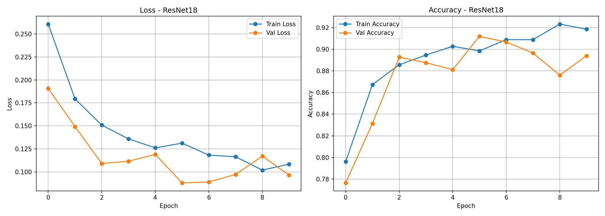
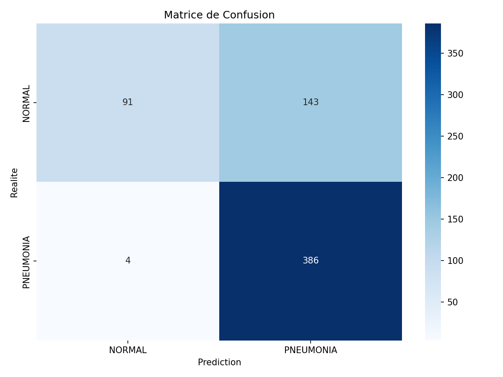
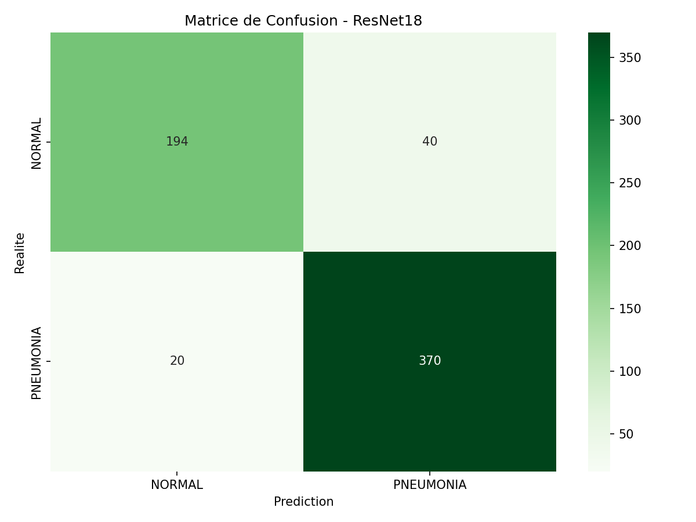
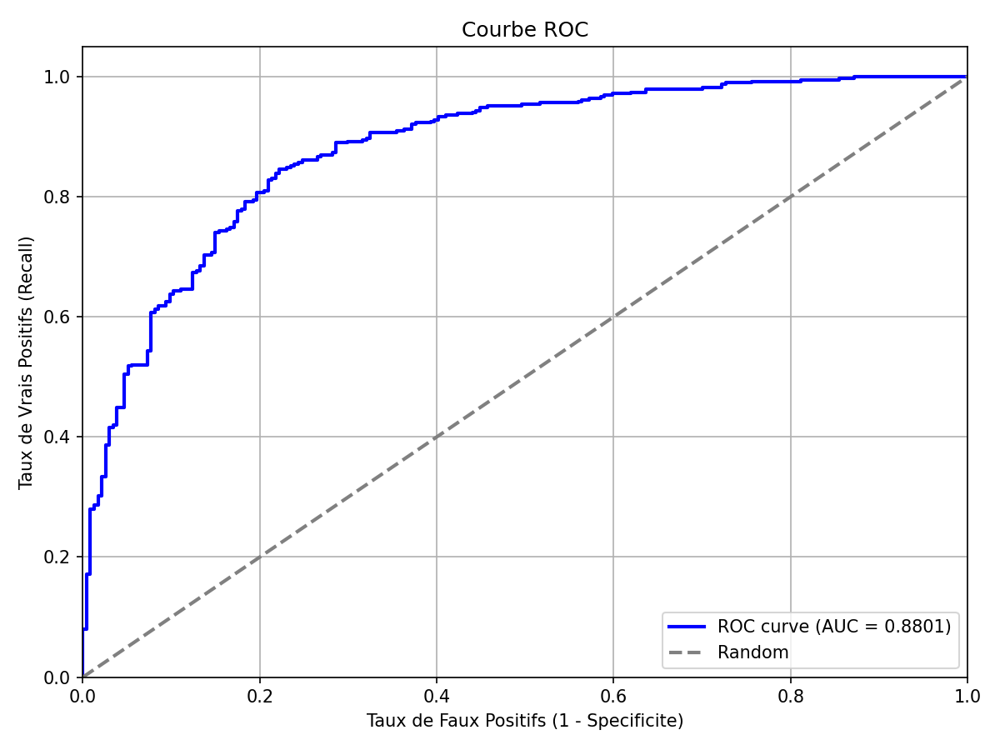
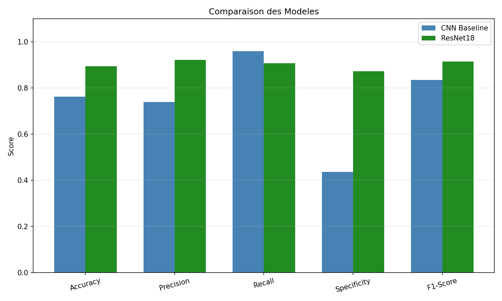
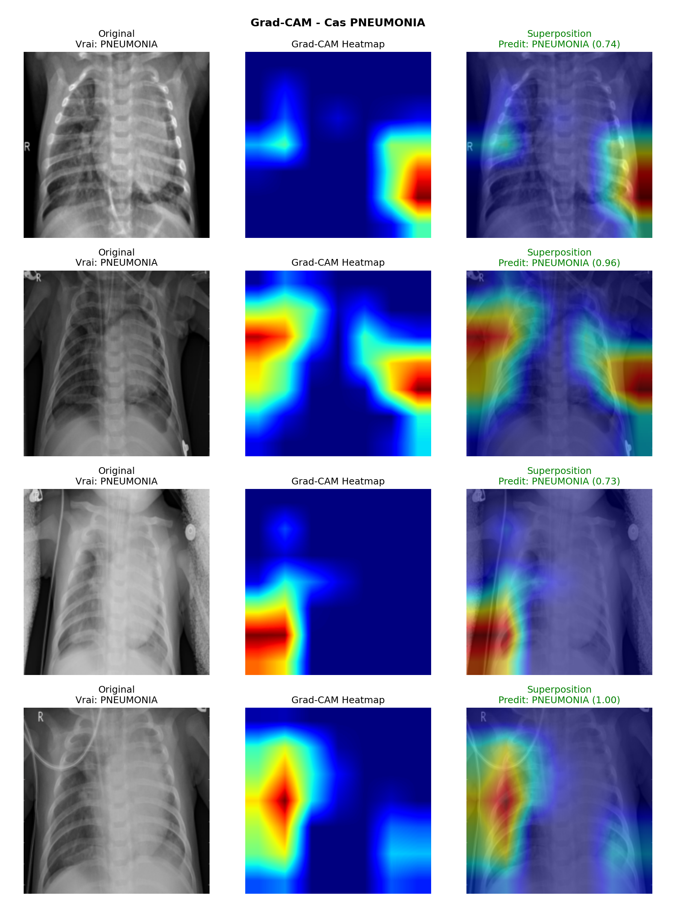
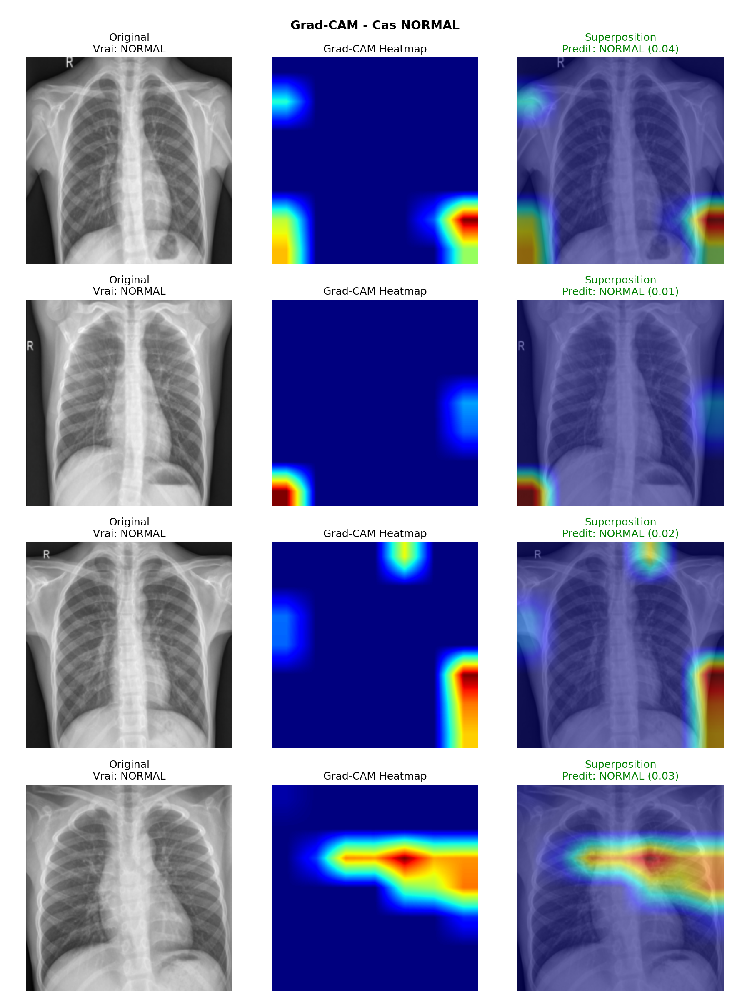
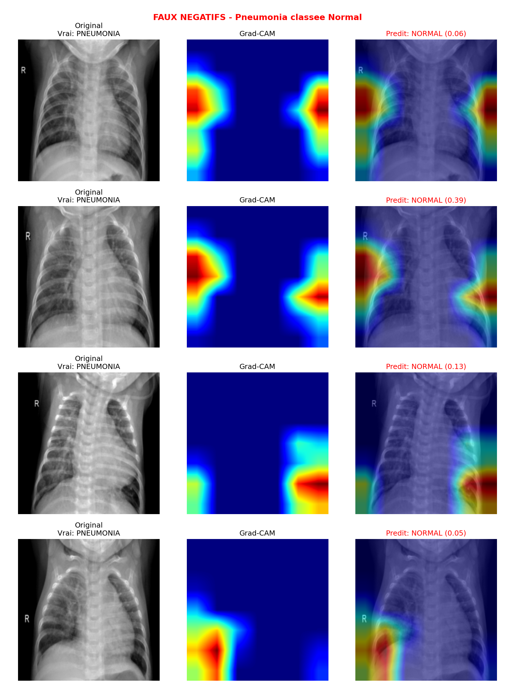

# Classification d'Images Medicales - Detection de Pneumonie

[](https://deeplearning-pneumonie.streamlit.app)

**[Tester l'application en ligne](https://deeplearning-pneumonie.streamlit.app)**

Projet de Deep Learning B3 - Classification binaire de radiographies thoraciques (NORMAL vs PNEUMONIA)

## Objectif

Developper un pipeline CNN capable de distinguer des radiographies thoraciques normales de celles presentant une pneumonie.

## Dataset

**Chest X-Ray Images (Pneumonia)** - Kaggle

| Set | NORMAL | PNEUMONIA | Total |
|-----|--------|-----------|-------|
| Train | 1,341 | 3,875 | 5,216 |
| Val | 8 | 8 | 16 |
| Test | 234 | 390 | 624 |

## Architecture

### CNN Baseline
```
Conv(32) + ReLU + MaxPool
Conv(64) + ReLU + MaxPool
Conv(128) + ReLU + MaxPool
Flatten -> Dense(128) + Dropout -> Dense(1) + Sigmoid
```

### ResNet18 (Transfer Learning)
- ResNet18 pre-entraine sur ImageNet
- Couches convolutives gelees
- Nouvelle tete de classification fine-tunee

## Resultats

### Comparaison des Modeles

| Metrique | CNN Baseline | ResNet18 | Amelioration |
|----------|--------------|----------|--------------|
| **Accuracy** | 76.28% | **89.42%** | +13.14% |
| **Precision** | 73.91% | **92.19%** | +18.28% |
| **Recall** | 95.90% | 90.77% | -5.13% |
| **Specificite** | 43.59% | **87.18%** | +43.59% |
| **F1-Score** | 83.48% | **91.47%** | +7.99% |

### Courbes d'Entrainement

#### CNN Baseline


#### ResNet18


### Matrice de Confusion

#### CNN Baseline


#### ResNet18


### Courbe ROC


### Comparaison des Modeles


## Interpretabilite - Grad-CAM

Visualisation des zones utilisees par le modele pour la classification.

### Cas PNEUMONIA


### Cas NORMAL


### Analyse des Erreurs (Faux Negatifs)


## Structure du Projet

```
DeepLearning/
├── data/
│   └── chest_xray/
│       ├── train/
│       ├── val/
│       └── test/
├── notebooks/
│   ├── 01_data_exploration.ipynb
│   ├── 02_training_cnn.ipynb
│   ├── 03_evaluation.ipynb
│   ├── 04_amelioration.ipynb
│   └── 05_gradcam.ipynb
├── outputs/
│   ├── checkpoints/
│   │   ├── best_model.pt
│   │   └── best_resnet18.pt
│   └── figures/
│       ├── training_curves.png
│       ├── confusion_matrix.png
│       ├── roc_curve.png
│       └── ...
├── app.py                 # Interface Streamlit
├── README.md
└── requirements.txt
```

## Installation

```bash
pip install torch torchvision numpy pandas matplotlib scikit-learn seaborn opencv-python streamlit
```

## Usage

### Entrainement
Executer les notebooks dans l'ordre:
1. `01_data_exploration.ipynb` - Exploration des donnees
2. `02_training_cnn.ipynb` - Entrainement CNN Baseline
3. `03_evaluation.ipynb` - Evaluation detaillee
4. `04_amelioration.ipynb` - Transfer Learning ResNet18
5. `05_gradcam.ipynb` - Interpretabilite

### Demo Streamlit
```bash
streamlit run app.py
```

## Technologies

- **PyTorch** - Framework Deep Learning
- **torchvision** - Modeles pre-entraines et transforms
- **scikit-learn** - Metriques d'evaluation
- **Streamlit** - Interface de demonstration
- **OpenCV** - Traitement d'images pour Grad-CAM

## Conclusion

- Le **Transfer Learning avec ResNet18** ameliore significativement les performances (+13% accuracy)
- La **specificite** passe de 44% a 87% (meilleure detection des cas normaux)
- **Grad-CAM** permet de verifier que le modele regarde les bonnes regions
- Le pipeline est **reproductible** et bien documente

## Auteur

Projet B3 Deep Learning - 2026
